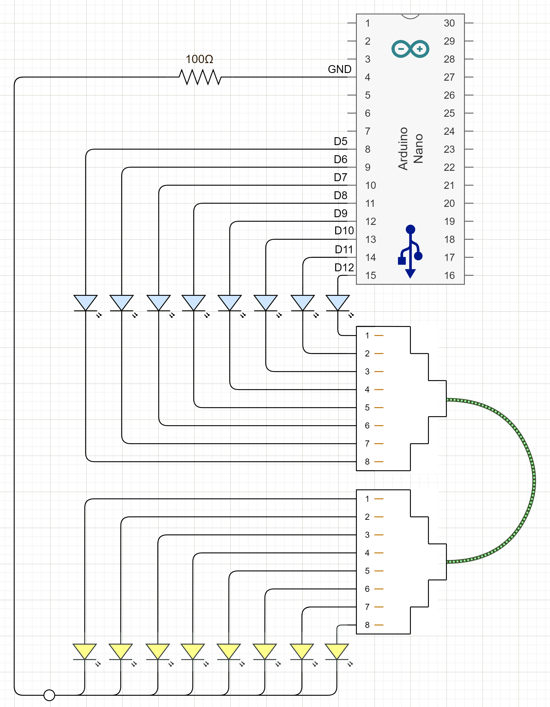

# Arduino-Network-Cable-Tester
Device code for an Arduino based network cable tester.

If you use an Arduino Nano connect network header to pins 5 to 12.
It is recommended to use a 100k ohm resistor in the return path to GND.
You can get away with no resistor if you choose diode colors with Vdrop1+Vdrop2=5V and pin current is around 10 mA.

See [NetworkTester.ino](NetworkTester.ino) file

[ Circuit Diagram ]

